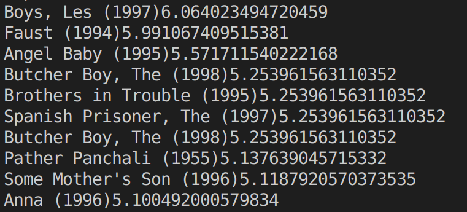
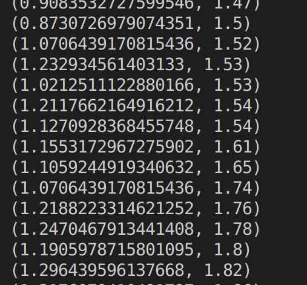

# 5-Machine-Learning-with-Spark-ML
15. [Introducing Spark.ML](#schema15)
16. [Linear Regression Spark.ML](#schema16)
17. [Decision Tree Spark.ML](#schema17)

# 15. Introducing Spark.ML

ALS (Alternating Least Squares).

1º Importamos todas la librerías y además esta nueva
~~~python
from pyspark.ml.recommendation import ALS
~~~
2º Creamos función para cargar los datos, y la sesion de spark

~~~python
def loadMovieNames():
    movieNames = {}
    # CHANGE THIS TO THE PATH TO YOUR u.ITEM FILE:
    with codecs.open("./data/ml-100k/u.item", "r", encoding='ISO-8859-1', errors='ignore') as f:
        for line in f:
            fields = line.split('|')
            movieNames[int(fields[0])] = fields[1]
    return movieNames

spark = SparkSession.builder.appName("ALSExample").getOrCreate()
~~~
3º Creamos el esquema para los datos para `ratings`, leemos los datos y le hacemos el esquema
~~~python
    
moviesSchema = StructType([ \
                     StructField("userID", IntegerType(), True), \
                     StructField("movieID", IntegerType(), True), \
                     StructField("rating", IntegerType(), True), \
                     StructField("timestamp", LongType(), True)])
    
names = loadMovieNames()
    
ratings = spark.read.option("sep", "\t").schema(moviesSchema) \
    .csv("./data/ml-100k/u.data")
~~~
4º Entrenamos el recomendador
~~~python    
print("Training recommendation model...")

als = ALS().setMaxIter(5).setRegParam(0.01).setUserCol("userID").setItemCol("movieID") \
    .setRatingCol("rating")
    
model = als.fit(ratings)
~~~
5º Construimos el dataframe con el `userID`
~~~python
# Manually construct a dataframe of the user ID's we want recs for
userID = int(sys.argv[1])
userSchema = StructType([StructField("userID", IntegerType(), True)])
users = spark.createDataFrame([[userID,]], userSchema)
~~~
6º Creamos las recomendaciones  `recommendations` e imprimimos los resultados
~~~python
recommendations = model.recommendForUserSubset(users, 10).collect()

print("Top 10 recommendations for user ID " + str(userID))

for userRecs in recommendations:
    myRecs = userRecs[1]  #userRecs is (userID, [Row(movieId, rating), Row(movieID, rating)...])
    for rec in myRecs: #my Recs is just the column of recs for the user
        movie = rec[0] #For each rec in the list, extract the movie ID and rating
        rating = rec[1]
        movieName = names[movie]
        print(movieName + str(rating))
        
~~~

# 16. Linear Regression Spark.ML
1º Importamos librerías
~~~python

from __future__ import print_function

from pyspark.ml.regression import LinearRegression

from pyspark.sql import SparkSession
from pyspark.ml.linalg import Vectors
~~~
2º Creamos la sesion, cargamos los datos y los convertimos al formato esperado por MLLib
~~~Python
if __name__ == "__main__":

    spark = SparkSession.builder.appName("LinearRegression").getOrCreate()

    inputLines = spark.sparkContext.textFile("./data/regression.txt")
    data = inputLines.map(lambda x: x.split(",")).map(lambda x: (float(x[0]), Vectors.dense(float(x[1]))))
~~~
3º Convertimos el RDD a dataframe
~~~python
    # Convert this RDD to a DataFrame
    colNames = ["label", "features"]
    df = data.toDF(colNames)
~~~ 
4º Separamps el dataframe en partes iguales para el training y el test
~~~python
      # Let's split our data into training data and testing data
    trainTest = df.randomSplit([0.5, 0.5])
    trainingDF = trainTest[0]
    testDF = trainTest[1]
~~~
5º Creamos el modelo de linear regression y lo entrenamos
~~~python

    lir = LinearRegression(maxIter=10, regParam=0.3, elasticNetParam=0.8)

    model = lir.fit(trainingDF)
~~~
6º Generamos las predicciones e imprimimos
~~~python
    
    fullPredictions = model.transform(testDF).cache()
    predictions = fullPredictions.select("prediction").rdd.map(lambda x: x[0])
    labels = fullPredictions.select("label").rdd.map(lambda x: x[0])

    predictionAndLabel = predictions.zip(labels).collect()

    
    for prediction in predictionAndLabel:
      print(prediction)

    # Stop the session
    spark.stop()
~~~

# 17. Decision Tree Spark.ML
1º Importar librerías

~~~python
from __future__ import print_function

from pyspark.ml.regression import DecisionTreeRegressor
from pyspark.sql import SparkSession
from pyspark.ml.feature import VectorAssembler
~~~
2º Crear sesion de spark y cargar los datos
~~~python
if __name__ == "__main__":

    spark = SparkSession.builder.appName("DecisionTree").getOrCreate()
    data = spark.read.option("header", "true").option("inferSchema", "true").csv("./data/realestate.csv")
~~~
3º Creamos el `assembler` que son los datos con los que vamos a crear las predicciones
~~~python
    assembler = VectorAssembler().setInputCols(["HouseAge", "DistanceToMRT", \
                               "NumberConvenienceStores"]).setOutputCol("features")
~~~
4º Creamos el dataframe `df` con `features` y `PriceOfUnitArea`
~~~python   
    df = assembler.transform(data).select("PriceOfUnitArea", "features")
~~~
5º Separamos los datos en dos datas, uno para training y otro para test
~~~python
    trainTest = df.randomSplit([0.5, 0.5])
    trainingDF = trainTest[0]
    testDF = trainTest[1]
~~~
6º Creamos nuestro decision tree y lo entrenamos con los valores de entrenamiento
~~~python
   dtr = DecisionTreeRegressor().setFeaturesCol("features").setLabelCol("PriceOfUnitArea")
   model = dtr.fit(trainingDF)
~~~
7º Evaluamos las prediciones con los valores de test e imprimimos los resultados
~~~python
    fullPredictions = model.transform(testDF).cache()

    predictions = fullPredictions.select("prediction").rdd.map(lambda x: x[0])
    labels = fullPredictions.select("PriceOfUnitArea").rdd.map(lambda x: x[0])

    predictionAndLabel = predictions.zip(labels).collect()

    for prediction in predictionAndLabel:
      print(prediction)

    # Stop the session
    spark.stop()
~~~